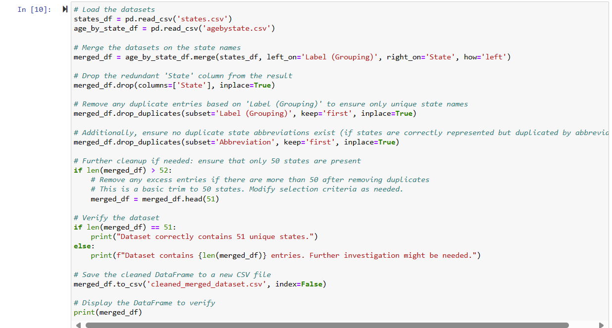
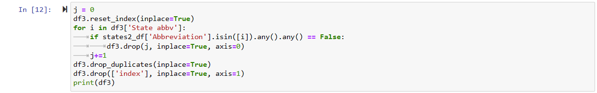
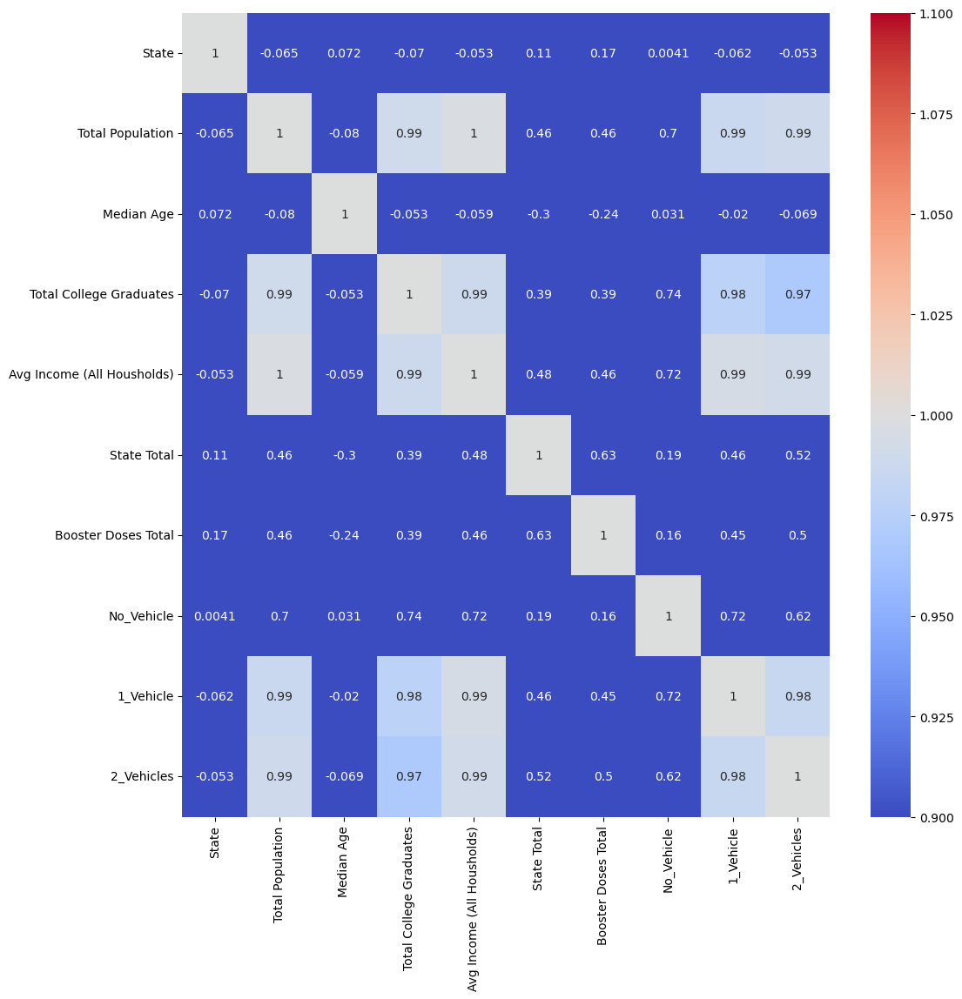
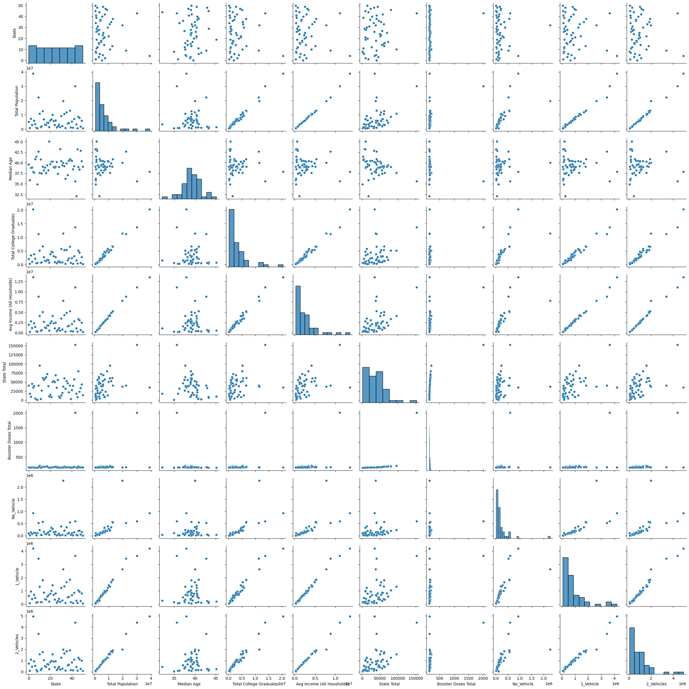

**<All Authors>** 
Samuel Wait
Thomas Medina-Herrera
Javier E Rios

## Project Summary

This project aims to leverage machine learning algorithms to predict the total number of initial COVID-19 vaccinations in U.S. states based on population data from the U.S. Census. We utilize COVID-19 vaccination data alongside U.S. Census data to train multiple regression models. By assessing performance using metrics such, MSE, RMSE, and correlation, we compare the models to identify the most effective algorithm. Our objective is to develop a robust model that can accurately predict vaccination trends, thereby aiding in the management and anticipation of public health responses to COVID-19 and similar future scenarios.

## Problem Statement 
We are using COVID-19 vaccination and United States Census data sets as training data for multiple machine learning algorithms to predict the total number of people who only recieved the inital vaccine in a state given population data from the U.S Census as the testing data set to help reduce and predict the impact of CODID-19 on future genations. We will then compare how each of the machine learning algorithms perform on the testing data based on a variety of different metrics, Mean Squared Error (MSE), Root Mean Squared Error (RMSE), and Correlation, using the actual average number of vaccinations in each state from the COVID-19 vaccination dataset as a benchmark. This will allow us to determine and train the best machine learning model to make predictions on simlilar datasets and make predictions for how the average number of COVID-19 vaccinations will be impacted in the future based on U.S. Census data.

## Dataset 

We are combining two separate datasets into one. The first dataset comes from the CDC that shows COVID-19 vaccination data in the United States by date, county, state, age range, dose number, number of vaccinations and boosters, type of vaccination, and much more. We are only interested in the total number of vaccinations in each state and the total number of inital vaccinations in each state in 2022, so we are pulling those columns and thier data into our combined data set. The second data set comes from teh United States Census, and consists of the remaining data needed such as total population, average age, average number of college graduates, average individual incomes, and average number of people who do not own a vehicle in each state. For the dimensions of each dataset, the CDC COVID-19 dataset consists of about 1.96 million rows and 80 columns, and the U.S. Census dataset should have around 50 rows (one for each state) and two to three columns. As stated before, we are not using all of the columns from the CDC COVID-19 dataset.

Here is a link to the CDC COVID-19 vaccination dataset we are using: https://data.cdc.gov/Vaccinations/COVID-19-Vaccinations-in-the-United-States-County/8xkx-amqh/about_data
To run it with the project, download it and put it in the /data folder in the /project folder (/project/data)

## Exploratory Data Analysis 

We are planning to use correlation matricies to generate heatmaps to show the correlation of the columns with each other. This will show which columns are more or less dependent on each other, allowing us to determine which columns are more impactful in the models making predictions on the testing data. The second EDA graph we are planning to use is a scatterplot set, which will generate a scatterplot for each column based on another column (as the x and y axis), plotting their corresponding values as datapoints on the scatterplots. This will help us visualize the data, giving us a good idea of how the models are viewing the data and how the columns relate to on another.

We used mulitiple algorithms processes to prepare the data for the machine learning models, shown below:

These algorithms and processes allowed us to prepare our data to use in our regression machine learning models, which are multiple linear regression, polynomial linear regression, decision trees regression, and ordinary least squares regression. Below shows EDA graphs we generated and used such as a correclation heatmap annd data column scatterplots:

## Data Preprocessing 

We are doing a considerable amount of dimensionality reduction, but no scaling. We are performing Dimensionality Reduction through feature selection on the CDC COVID-19 dataset, meaning we are only selecting columns or features that are relavent to the problem we are trying to solve and our models. To do this, we are are combining and reducing all of the vaccination data to give us the total vaccinations in each state and the total number of 1st vaccinations by state. We then need to combine all of the processed data from the CDC COVID-19 dataset with the U.S. Census datasets to make our singular dataset to use in our machine learning models.

## Machine Learning Approaches

Since we are making predictions on testing data based on training data, rather than classifying testing data based on training data, we will be using Regression Machine Learning algorithms. Under the Regression algorithms umbrella, we are choosing to use the Decision Regression Trees and Random Forests algorithm and Multiple Linear Regression algorithm. We are choosing to use these two algorithms because we have multple features and columns, and Multiple Linear Regression and Decision Regression Trees can handle numerous columns, are easy to explain and visualize on graphs, and can easily avoid overfitting and underfitting on the training data, so they seem like the logical choice. The baseline model we are using for evaluation is the Multiple Linear Regression algorithm because it is the most simple, and therefore easiest to visualize and compare to.

We originally had multiple data sets loaded in corresponding data frames, using the data preprocessing processes and algorithms outlined above, we combined those data frames into one so that our regression models could be properly trained based on the data we wanted them to be trained on. We ended up using a few regression machine learning models, our baseline being multiple linear regression. The improvement regression models were decision trees, ordinary least squares, and polynomial linear regression models. 

## Experiments 

Experiments are included in the project.ipynb file and includes experiments with the regression machine learning models outlined above. Our evaluation methods were mean squared error, score, and root mean squared error. The other regression models demonstrated a vast improvement on the baseline multiple linear regression model, which showed a negative score. Based on the value of the improvement model's scores, these models did not show a drastic over oor under fit on the dataset. All of our models were evaluated on the same dataset, but the test training split may have been sligtly altered depending on the dataset. The models and thier results with metrics are shown in the accompanying project.ipynb file. 

## Conclusion

Though we ran into some trouble with our data preprocessing, the only thing that did not work in our project was our baseline multiple linear regression model, as we got a negative model score value. We think that this is because the correlation values between our data columns we not very high, so the mulitple linear regression modle did not fit to our data very well.

Our main approach was to perform a lot af data preprocessing and data manipulations to properly combine the datasets we are using into one dataset and preparing that dataset and dataframe so it could be used in out multiple linear, polynomial linear, decision tree, and ordinary least squares regression models. The data preprocessing included extensive manual feature selection and properly merging and sorting data frames so that the data does not become compromised. Because we did extensive feature selection, all of our features seem to work well in our machine learning models, with the exception of the multiple linear regression model because of the reasons mentioned above. Ulitimately, the regression models that worked the best with our data are the polynomial or ordinary least squares regression models, as both of their scores imply that they did not over or underfit based on the data.
